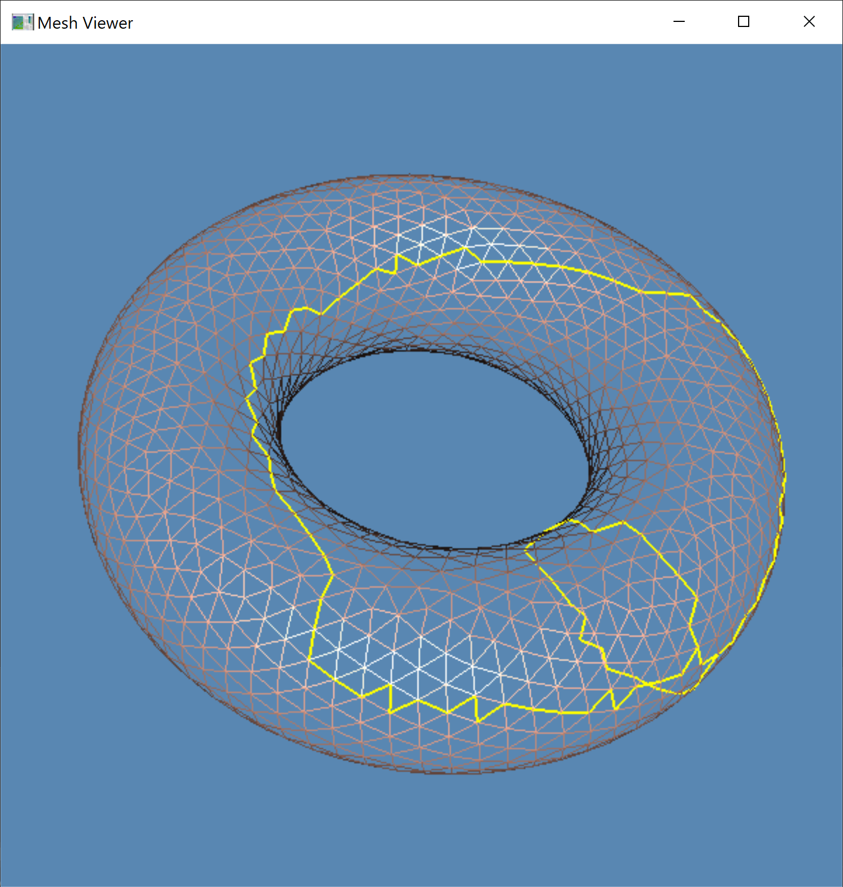
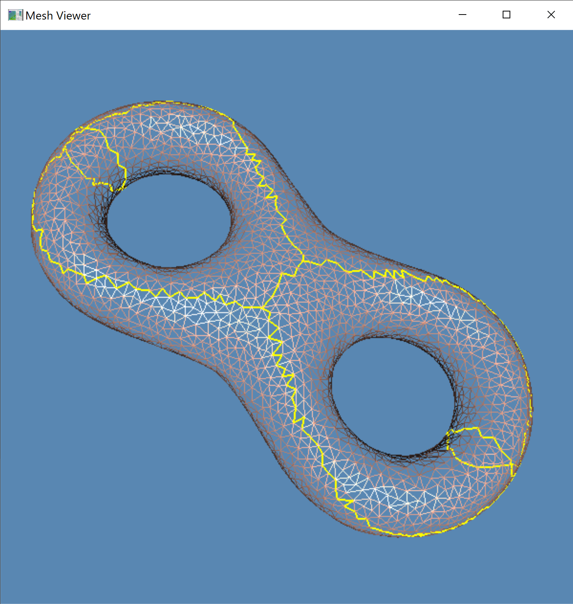

# Computational Conformal Geometry Homework

This C++ project framework is used to help students to implement geometric algorithms. It contains a halfedge data structure library `MeshLib` and an simple opengl viewer.

## System

The code is only tested on Windows, but it should work on Linux and Mac with minor midifications. If there is any problem on the latter two platforms, please let me know.

## Dependencies
 
1. `MeshLib`, a mesh library based on halfedge data structure.
2. `freeglut`, a free-software/open-source alternative to the OpenGL Utility Toolkit (GLUT) library.

## Directory Structure

``` txt
cutgraph/include        -- The header files of cut graph algorithm.
cutgraph/src            -- The source files of cut graph algorithm. 
data                    -- Some models.
CMakeLists.txt          -- CMake configuration file.
resources               -- Some resources needed.
3rdparty                -- MeshLib and freeglut libraries.
```

## Configuration

### Windows

1. Install [CMake](https://cmake.org/download/).

2. Download the source code of the C++ framework.
> E.x. I create a folder `projects` in `C:/`, then unzip the source code there.

3. Configure and generate the project for Visual Studio.
  
> ``` bash
> cd CCGHomework
> mkdir build
> cd build
> cmake ..
> ```
> *One can also finish this step using CMake GUI.*

4. Open the \*.sln using Visual Studio, and complie the solution.

5. Finish your code in your IDE.

6. Run the executable program.
> E.x. 
> ``` bash
> cd bin
> ./CutGraph.exe ../data/torus.m
> ./CutGraph.exe ../data/eight.m
> ```
> If you can see the following results, then it means that you have finished the cut graph algorithm. 
> 
>  
